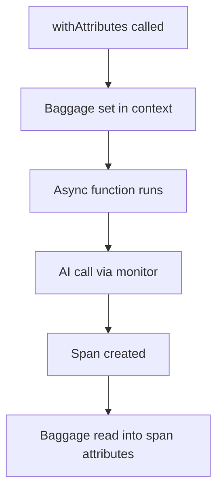

Knowing the total cost isn't enough. You need to know _who_ spent _what_ on _which feature_. Tokenmeter's `withAttributes()` function lets you attach context to all AI calls within a scope.

## Basic Usage

Wrap any code block with `withAttributes()`. All AI calls inside inherit the attributes:

```typescript
import { withAttributes } from 'tokenmeter';

await withAttributes({ 'user.id': 'user_123' }, async () => {
  // All AI calls here are tagged with user.id
  await openai.chat.completions.create({ ... });
  await anthropic.messages.create({ ... });
});
```

The resulting spans include both the cost and the user:

```
{
  'tokenmeter.cost_usd': 0.00045,
  'user.id': 'user_123'
}
```

## Common Attributes

Use consistent attribute names across your application:

| Attribute | Example | Purpose |
|-----------|---------|---------|
| `user.id` | `'user_123'` | Bill costs to users |
| `org.id` | `'acme'` | Bill costs to organizations |
| `workflow.id` | `'summarize'` | Understand feature costs |
| `request.id` | `'req_abc'` | Trace specific requests |
| `environment` | `'production'` | Filter by environment |

```typescript
await withAttributes({
  'user.id': userId,
  'org.id': orgId,
  'workflow.id': 'document-analysis',
}, async () => {
  // Multiple AI calls, all attributed to this context
  const summary = await summarize(document);
  const entities = await extractEntities(document);
  return { summary, entities };
});
```

## Nesting

`withAttributes()` calls can be nested. Inner attributes merge with outer ones:

```typescript
await withAttributes({ 'org.id': 'acme' }, async () => {
  // Only org.id is set here
  
  await withAttributes({ 'user.id': 'user_123' }, async () => {
    // Both org.id and user.id are set here
    await openai.chat.completions.create({ ... });
  });
  
  await withAttributes({ 'user.id': 'user_456' }, async () => {
    // org.id is 'acme', user.id is 'user_456'
    await openai.chat.completions.create({ ... });
  });
});
```

Inner values override outer ones with the same key:

```typescript
await withAttributes({ 'feature': 'chat' }, async () => {
  await withAttributes({ 'feature': 'analysis' }, async () => {
    // feature is 'analysis', not 'chat'
  });
});
```

## Request Handler Pattern

The most common pattern is wrapping your entire request handler:

```typescript
app.post('/api/chat', async (req, res) => {
  await withAttributes({
    'user.id': req.user.id,
    'org.id': req.user.orgId,
    'request.id': req.id,
  }, async () => {
    // All AI calls in this request are attributed
    const response = await processChat(req.body);
    res.json(response);
  });
});
```

## Framework Integrations

For common frameworks, Tokenmeter provides wrappers that handle this pattern:

<CardGroup cols={2}>
  <Card title="Next.js" href="/guides/nextjs">
    `withTokenmeter()` for App Router
  </Card>
  <Card title="Inngest" href="/guides/inngest">
    `withInngest()` for background functions
  </Card>
</CardGroup>

## Reading Current Attributes

You can read the current attributes from anywhere in the call stack:

```typescript
import { getCurrentAttributes, getAttribute } from 'tokenmeter';

// Get all attributes
const attrs = getCurrentAttributes();
console.log(attrs['user.id']); // 'user_123'

// Get a specific attribute
const userId = getAttribute('user.id');
```

This is useful for logging or conditional logic based on context.

## Synchronous Version

For synchronous code, use `withAttributesSync()`:

```typescript
import { withAttributesSync } from 'tokenmeter';

const result = withAttributesSync({ 'step': 'preprocessing' }, () => {
  // Synchronous work here
  return processSync(data);
});
```

## How It Works

`withAttributes()` uses OpenTelemetry Baggage to propagate context. Baggage is designed for cross-cutting concerns that need to flow through async boundaries and even across services.

When a monitored client creates a span, it reads attributes from the current baggage and adds them to the span.



This means attributes propagate automatically through:
- Async/await
- Promise chains  
- setTimeout/setImmediate
- Event handlers

