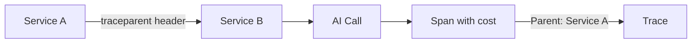

In distributed systems, a single user request may flow through multiple services. Tokenmeter propagates trace context so costs from all services are linked to the original request.

## The Problem

Without propagation, each service creates independent traces:

```
API Gateway → Service A → AI call (tracked in Service A's trace)
           ↘ Service B → AI call (tracked in Service B's trace)
```

You can't answer: "What was the total AI cost for this user request?"

With propagation:

```
API Gateway → Service A → AI call ─┐
           ↘ Service B → AI call ─┴─→ All linked to same trace
```

## How It Works

OpenTelemetry uses W3C Trace Context headers to propagate trace identity across HTTP requests. Tokenmeter reads these headers and links AI costs to the parent trace.



## Extracting Headers

Use `extractTraceHeaders()` to get headers for outgoing requests:

```typescript
import { extractTraceHeaders } from 'tokenmeter';

// Get current trace context as HTTP headers
const headers = extractTraceHeaders();

// Add to outgoing request
await fetch('https://service-b.example.com/api/process', {
  method: 'POST',
  headers: {
    'Content-Type': 'application/json',
    ...headers, // Includes traceparent, tracestate
  },
  body: JSON.stringify({ data }),
});
```

## Restoring Context

In the receiving service, restore context with `withExtractedContext()`:

```typescript
import { withExtractedContext } from 'tokenmeter';
import { monitor } from 'tokenmeter';

const openai = monitor(new OpenAI());

app.post('/api/process', async (req, res) => {
  await withExtractedContext(req.headers, async () => {
    // AI calls here are linked to the caller's trace
    const response = await openai.chat.completions.create({
      model: 'gpt-4o',
      messages: [{ role: 'user', content: req.body.prompt }],
    });
    
    res.json({ result: response.choices[0].message.content });
  });
});
```

## Combining with Attributes

`withExtractedContext()` restores both trace context and baggage (attributes):

```typescript
// Service A
await withAttributes({ 'user.id': 'user_123' }, async () => {
  const headers = extractTraceHeaders();
  await fetch('https://service-b/process', { headers });
});

// Service B
await withExtractedContext(req.headers, async () => {
  // user.id is available here via baggage
  const userId = getAttribute('user.id'); // 'user_123'
  
  // AI calls are tagged with user.id and linked to Service A's trace
  await openai.chat.completions.create({ ... });
});
```

## Express Middleware

Create middleware for automatic context restoration:

```typescript
import { withExtractedContext } from 'tokenmeter';

function tokenmeterMiddleware(req, res, next) {
  withExtractedContext(req.headers, () => {
    next();
  }).catch(next);
}

app.use(tokenmeterMiddleware);

// Now all route handlers have context restored
app.post('/api/chat', async (req, res) => {
  // Automatically linked to caller's trace
  await openai.chat.completions.create({ ... });
});
```

## Fetch Wrapper

Create a wrapper that automatically adds headers:

```typescript
import { extractTraceHeaders } from 'tokenmeter';

async function tracedFetch(url: string, options: RequestInit = {}) {
  const headers = extractTraceHeaders();
  
  return fetch(url, {
    ...options,
    headers: {
      ...options.headers,
      ...headers,
    },
  });
}

// Use instead of fetch
await tracedFetch('https://service-b/api/process', {
  method: 'POST',
  body: JSON.stringify({ data }),
});
```

## gRPC

For gRPC, extract headers and pass as metadata:

```typescript
import { extractTraceHeaders } from 'tokenmeter';
import * as grpc from '@grpc/grpc-js';

const headers = extractTraceHeaders();
const metadata = new grpc.Metadata();

for (const [key, value] of Object.entries(headers)) {
  if (value) metadata.set(key, value);
}

client.processDocument({ data }, metadata, (err, response) => {
  // ...
});
```

## Message Queues

For async messaging (SQS, RabbitMQ, Kafka), include headers in message attributes:

```typescript
// Producer
import { extractTraceHeaders } from 'tokenmeter';

const headers = extractTraceHeaders();

await sqs.sendMessage({
  QueueUrl: queueUrl,
  MessageBody: JSON.stringify({ data }),
  MessageAttributes: {
    traceparent: { DataType: 'String', StringValue: headers.traceparent },
    tracestate: { DataType: 'String', StringValue: headers.tracestate || '' },
  },
});
```

```typescript
// Consumer
import { withExtractedContext } from 'tokenmeter';

sqs.on('message', async (message) => {
  const headers = {
    traceparent: message.MessageAttributes?.traceparent?.StringValue,
    tracestate: message.MessageAttributes?.tracestate?.StringValue,
  };
  
  await withExtractedContext(headers, async () => {
    // AI calls linked to original producer's trace
    await openai.chat.completions.create({ ... });
  });
});
```

## Complete Example

```typescript api-gateway/routes/chat.ts
import { withAttributes, extractTraceHeaders } from 'tokenmeter';

app.post('/api/chat', async (req, res) => {
  await withAttributes({ 
    'user.id': req.user.id,
    'request.id': req.id,
  }, async () => {
    // Call the AI service with trace context
    const response = await fetch('https://ai-service/generate', {
      method: 'POST',
      headers: {
        'Content-Type': 'application/json',
        ...extractTraceHeaders(),
      },
      body: JSON.stringify({ prompt: req.body.message }),
    });
    
    res.json(await response.json());
  });
});
```

```typescript ai-service/routes/generate.ts
import { withExtractedContext, monitor } from 'tokenmeter';

const openai = monitor(new OpenAI());

app.post('/generate', async (req, res) => {
  await withExtractedContext(req.headers, async () => {
    // This span is a child of the API Gateway's span
    // user.id is available from baggage
    const response = await openai.chat.completions.create({
      model: 'gpt-4o',
      messages: [{ role: 'user', content: req.body.prompt }],
    });
    
    res.json({ text: response.choices[0].message.content });
  });
});
```

When you query costs by `user.id`, you get the total across all services.

## Headers Reference

| Header | Purpose |
|--------|---------|
| `traceparent` | W3C Trace Context - trace ID and span ID |
| `tracestate` | W3C Trace Context - vendor-specific data |
| `baggage` | W3C Baggage - key-value pairs (attributes) |

These are standard headers supported by all OpenTelemetry-compatible systems.

