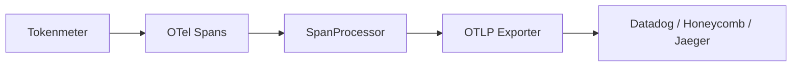

Tokenmeter works with any OpenTelemetry-compatible backend. This guide covers common configurations.

## How It Works

Tokenmeter adds cost attributes to OpenTelemetry spans. Your span exporter sends these to your observability platform, where you can query, visualize, and alert on them.



## Common Setup

Most platforms use the OTLP exporter:

```bash
npm install @opentelemetry/exporter-trace-otlp-http
```

```typescript tracing.ts
import { NodeTracerProvider } from '@opentelemetry/sdk-trace-node';
import { BatchSpanProcessor } from '@opentelemetry/sdk-trace-base';
import { OTLPTraceExporter } from '@opentelemetry/exporter-trace-otlp-http';

const provider = new NodeTracerProvider();

provider.addSpanProcessor(
  new BatchSpanProcessor(
    new OTLPTraceExporter({
      url: process.env.OTEL_EXPORTER_OTLP_ENDPOINT,
      headers: {
        // Platform-specific headers
      },
    })
  )
);

provider.register();
```

## Datadog

```typescript
provider.addSpanProcessor(
  new BatchSpanProcessor(
    new OTLPTraceExporter({
      url: 'https://trace.agent.datadoghq.com/v0.4/traces',
      headers: {
        'DD-API-KEY': process.env.DD_API_KEY,
      },
    })
  )
);
```

In Datadog, query costs with:
- `@tokenmeter.cost_usd:>0` — all AI calls
- `@user.id:user_123 @tokenmeter.cost_usd:*` — costs for a specific user
- `sum:tokenmeter.cost_usd{*} by {user.id}` — total cost by user

## Honeycomb

```typescript
provider.addSpanProcessor(
  new BatchSpanProcessor(
    new OTLPTraceExporter({
      url: 'https://api.honeycomb.io/v1/traces',
      headers: {
        'x-honeycomb-team': process.env.HONEYCOMB_API_KEY,
      },
    })
  )
);
```

In Honeycomb, use the query builder:
- GROUP BY `user.id`, CALCULATE SUM(`tokenmeter.cost_usd`)
- VISUALIZE HEATMAP(`tokenmeter.cost_usd`)

## Jaeger

For local development or self-hosted Jaeger:

```typescript
provider.addSpanProcessor(
  new BatchSpanProcessor(
    new OTLPTraceExporter({
      url: 'http://localhost:4318/v1/traces',
    })
  )
);
```

Or with the Jaeger-specific exporter:

```bash
npm install @opentelemetry/exporter-jaeger
```

```typescript
import { JaegerExporter } from '@opentelemetry/exporter-jaeger';

provider.addSpanProcessor(
  new BatchSpanProcessor(
    new JaegerExporter({
      endpoint: 'http://localhost:14268/api/traces',
    })
  )
);
```

## Grafana Tempo

```typescript
provider.addSpanProcessor(
  new BatchSpanProcessor(
    new OTLPTraceExporter({
      url: 'http://tempo:4318/v1/traces',
    })
  )
);
```

Use TraceQL to query:

```
{ span.tokenmeter.cost_usd > 0.01 }
```

## New Relic

```typescript
provider.addSpanProcessor(
  new BatchSpanProcessor(
    new OTLPTraceExporter({
      url: 'https://otlp.nr-data.net:4318/v1/traces',
      headers: {
        'api-key': process.env.NEW_RELIC_LICENSE_KEY,
      },
    })
  )
);
```

## Axiom

```typescript
provider.addSpanProcessor(
  new BatchSpanProcessor(
    new OTLPTraceExporter({
      url: 'https://api.axiom.co/v1/traces',
      headers: {
        'Authorization': `Bearer ${process.env.AXIOM_API_TOKEN}`,
        'X-Axiom-Dataset': 'traces',
      },
    })
  )
);
```

## Console (Development)

For local development, print spans to console:

```typescript
import { SimpleSpanProcessor, ConsoleSpanExporter } from '@opentelemetry/sdk-trace-base';

provider.addSpanProcessor(
  new SimpleSpanProcessor(new ConsoleSpanExporter())
);
```

## Multiple Exporters

Send to multiple destinations:

```typescript
import { BatchSpanProcessor, SimpleSpanProcessor, ConsoleSpanExporter } from '@opentelemetry/sdk-trace-base';
import { OTLPTraceExporter } from '@opentelemetry/exporter-trace-otlp-http';

const provider = new NodeTracerProvider();

// Send to Datadog
provider.addSpanProcessor(
  new BatchSpanProcessor(
    new OTLPTraceExporter({
      url: 'https://trace.agent.datadoghq.com/v0.4/traces',
      headers: { 'DD-API-KEY': process.env.DD_API_KEY },
    })
  )
);

// Also print to console in development
if (process.env.NODE_ENV === 'development') {
  provider.addSpanProcessor(
    new SimpleSpanProcessor(new ConsoleSpanExporter())
  );
}

provider.register();
```

## Batch vs Simple Processor

- **BatchSpanProcessor** — Buffers spans and exports in batches. Use for production.
- **SimpleSpanProcessor** — Exports immediately. Use for development/debugging.

```typescript
// Production
provider.addSpanProcessor(new BatchSpanProcessor(exporter));

// Development
provider.addSpanProcessor(new SimpleSpanProcessor(exporter));
```

## Cost Dashboards

Once data flows, create dashboards to answer:

1. **Total spend** — Sum `tokenmeter.cost_usd` over time
2. **Cost by user** — Group by `user.id`, sum cost
3. **Cost by model** — Group by `tokenmeter.model`, sum cost
4. **Cost by workflow** — Group by `workflow.id`, sum cost
5. **Expensive requests** — Filter where cost > threshold

Example Datadog dashboard query:

```
sum:tokenmeter.cost_usd{*} by {tokenmeter.model}.as_count()
```

## Alerting

Set up alerts for unusual spending:

- **Budget alerts** — When daily cost exceeds threshold
- **Anomaly detection** — When cost pattern changes significantly
- **Per-user limits** — When a single user exceeds their allocation

Most platforms support alerting on span attributes directly.

