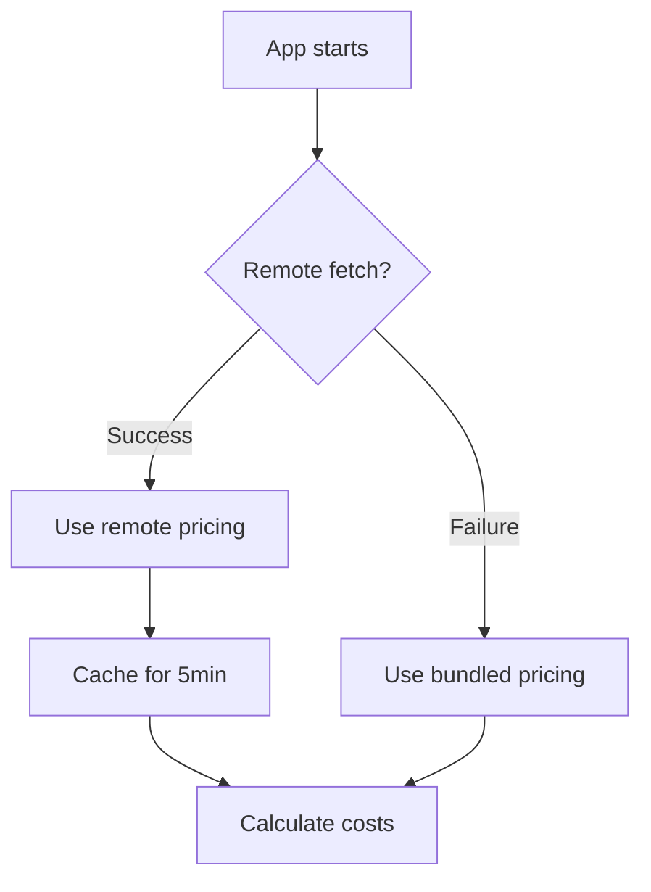

Tokenmeter calculates costs using a pricing manifest—a JSON file with per-model pricing. By default, it uses bundled pricing with optional remote updates.

## How Pricing Works

1. **Bundled pricing** — Compiled at build time from provider pricing pages
2. **Remote refresh** — Fetches updates from a pricing API on startup
3. **Local cache** — Caches remote pricing for 5 minutes
4. **Fallback** — Uses bundled pricing if remote fetch fails



## Offline Mode

Disable remote fetching to use only bundled pricing:

```typescript
import { configurePricing } from 'tokenmeter';

configurePricing({ offlineMode: true });
```

Use this when:
- Running in environments without internet access
- You want deterministic pricing (no remote updates)
- You're testing and don't want network calls

## Custom Pricing API

Point to your own pricing API:

```typescript
configurePricing({
  apiUrl: 'https://your-api.com/pricing/manifest.json',
});
```

The API should return a manifest in this format:

```json
{
  "version": "1.0.0",
  "updatedAt": "2024-01-15T00:00:00Z",
  "providers": {
    "openai": {
      "gpt-4o": {
        "input": 2.50,
        "output": 10.00,
        "unit": "1M_tokens"
      }
    }
  }
}
```

## Force Refresh

Manually refresh pricing data:

```typescript
import { loadManifest } from 'tokenmeter';

await loadManifest({ forceRefresh: true });
```

This bypasses the cache and fetches fresh data.

## Model Aliases

Map custom model names to known models:

```typescript
import { setModelAliases } from 'tokenmeter';

setModelAliases({
  // Fine-tuned models
  'ft:gpt-4o:my-org:custom:abc123': 'openai/gpt-4o',
  
  // Custom deployment names
  'azure-gpt4': 'openai/gpt-4o',
  'bedrock-claude': 'anthropic/claude-3-5-sonnet-20240620',
  
  // Internal model registry
  'llm-prod-v2': 'openai/gpt-4o',
});
```

When Tokenmeter encounters an unknown model, it checks aliases before falling back to zero cost.

## Clear Aliases

Remove all aliases:

```typescript
import { clearModelAliases } from 'tokenmeter';

clearModelAliases();
```

## Get Current Aliases

View configured aliases:

```typescript
import { getModelAliases } from 'tokenmeter';

const aliases = getModelAliases();
console.log(aliases);
// { 'ft:gpt-4o:...': 'openai/gpt-4o', ... }
```

## Checking Pricing

Look up pricing for a specific model:

```typescript
import { getModelPricing } from 'tokenmeter';

const pricing = getModelPricing('openai', 'gpt-4o');

if (pricing) {
  console.log(`Input: $${pricing.input} per ${pricing.unit}`);
  console.log(`Output: $${pricing.output} per ${pricing.unit}`);
} else {
  console.log('Model not found in pricing manifest');
}
```

## Calculate Cost Manually

Calculate cost from usage data:

```typescript
import { calculateCost } from 'tokenmeter';

const cost = calculateCost({
  provider: 'openai',
  model: 'gpt-4o',
  inputUnits: 1500,  // tokens
  outputUnits: 500,
});

console.log(`Cost: $${cost.toFixed(6)}`);
```

## Cache Management

View cached manifest:

```typescript
import { getCachedManifest } from 'tokenmeter';

const manifest = getCachedManifest();
if (manifest) {
  console.log(`Version: ${manifest.version}`);
  console.log(`Updated: ${manifest.updatedAt}`);
}
```

Clear the cache:

```typescript
import { clearManifestCache } from 'tokenmeter';

clearManifestCache();
```

## Current Configuration

View current pricing configuration:

```typescript
import { getPricingConfig } from 'tokenmeter';

const config = getPricingConfig();
console.log(config);
// { offlineMode: false, apiUrl: 'https://...', cacheMs: 300000 }
```

## Pricing Units

Different providers use different pricing units:

| Provider | Unit | Example |
|----------|------|---------|
| OpenAI | per 1M tokens | `$2.50 / 1M input tokens` |
| Anthropic | per 1M tokens | `$3.00 / 1M input tokens` |
| fal.ai | varies | per request, per megapixel, per second |
| ElevenLabs | per 1K characters | `$0.30 / 1K chars` |

Tokenmeter normalizes these internally for consistent `cost_usd` values.

## Unknown Models

When Tokenmeter encounters an unknown model:

1. Checks model aliases
2. Tries partial matching (e.g., `gpt-4o-2024-05-13` → `gpt-4o`)
3. Falls back to zero cost with a warning log

```typescript
import { configureLogger } from 'tokenmeter';

// Enable warnings to see unknown model alerts
configureLogger({ level: 'warn' });
```

## Contributing Pricing Updates

If you notice outdated pricing:

1. Check the bundled manifest at `src/pricing/manifest.json`
2. Update with current pricing from provider pages
3. Submit a PR

See [Contributing](/resources/contributing).

