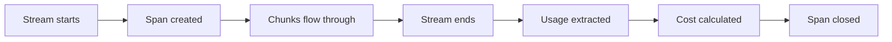

Tokenmeter handles streaming responses automatically. Cost is calculated when the stream completes, not when it starts.

## How It Works

When you call a streaming API through a monitored client:

1. The span is created immediately
2. The stream is wrapped to intercept chunks
3. You iterate the stream as normal
4. When the stream ends, usage is extracted and cost is calculated
5. The span is closed with the final cost



## OpenAI Streaming

For OpenAI, you must enable `stream_options` to get usage data in streaming mode:

```typescript
const stream = await openai.chat.completions.create({
  model: 'gpt-4o',
  messages: [{ role: 'user', content: 'Hello!' }],
  stream: true,
  stream_options: { include_usage: true }, // Required for cost tracking
});

for await (const chunk of stream) {
  process.stdout.write(chunk.choices[0]?.delta?.content || '');
}
// Cost is calculated here, when the stream completes
```

<Warning>
  Without `stream_options: { include_usage: true }`, OpenAI streaming responses don't include token counts, so cost cannot be calculated.
</Warning>

## Anthropic Streaming

Anthropic streaming includes usage data by default. No special options needed:

```typescript
const stream = anthropic.messages.stream({
  model: 'claude-3-5-sonnet-20240620',
  max_tokens: 1024,
  messages: [{ role: 'user', content: 'Hello!' }],
});

for await (const event of stream) {
  if (event.type === 'content_block_delta') {
    process.stdout.write(event.delta.text);
  }
}

const finalMessage = await stream.finalMessage();
// Cost is calculated when stream completes
```

## Getting Cost from Streams

Use `withCost()` to capture cost from streaming responses:

```typescript
import { withCost } from 'tokenmeter';

const { result: stream, cost } = await withCost(async () => {
  const stream = await openai.chat.completions.create({
    model: 'gpt-4o',
    messages: [{ role: 'user', content: 'Hello!' }],
    stream: true,
    stream_options: { include_usage: true },
  });
  
  // Consume the stream
  for await (const chunk of stream) {
    process.stdout.write(chunk.choices[0]?.delta?.content || '');
  }
  
  return stream;
});

console.log(`Stream cost: $${cost.toFixed(6)}`);
```

## Hooks with Streaming

Hooks work with streaming, but `afterResponse` is called when the stream completes, not when it starts:

```typescript
const openai = monitor(new OpenAI(), {
  afterResponse: (ctx) => {
    // Called after stream is fully consumed
    console.log(`Stream completed. Cost: $${ctx.cost.toFixed(6)}`);
  },
});
```

## Interrupted Streams

If a stream is interrupted (connection dropped, consumer throws, etc.), Tokenmeter still records partial cost based on chunks received.

```typescript
try {
  for await (const chunk of stream) {
    if (shouldStop()) {
      break; // Stream interrupted
    }
    process.stdout.write(chunk.choices[0]?.delta?.content || '');
  }
} catch (error) {
  // Stream error
}
// Partial cost is still recorded in the span
```

## Best Practices

1. **Always set `stream_options` for OpenAI** — Without it, you get no token counts and cost is zero.

2. **Fully consume streams** — Cost is only calculated when the stream ends. If you don't consume it, the span stays open.

3. **Handle errors** — Wrap stream consumption in try/catch. The span will close and record partial data on error.

4. **Use withCost for immediate access** — If you need the cost right away, wrap the stream consumption in `withCost()`.

