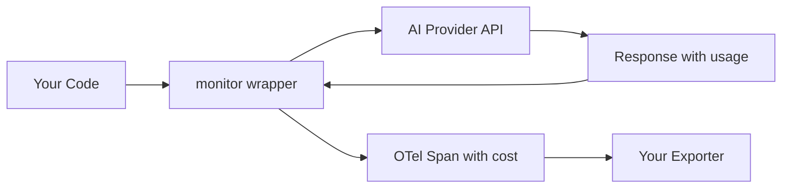

You're spending money on AI API calls, but you can't answer basic questions:

- Which user drove that $500 spike last Tuesday?
- Is the summarization feature worth its API cost?
- How much did this workflow run cost?

Tokenmeter adds cost tracking to your existing code without rewrites.

```typescript
// Before
const openai = new OpenAI();

// After
const openai = monitor(new OpenAI());
```

That's it. Your OpenTelemetry spans now include `tokenmeter.cost_usd`, `tokenmeter.provider`, and `tokenmeter.model`. Types are preserved—autocomplete works exactly as before.

## What Tokenmeter Does

Tokenmeter is an OpenTelemetry-native library that:

1. **Wraps AI clients transparently** — `monitor(client)` returns the same type, no code changes needed
2. **Calculates costs automatically** — Uses up-to-date pricing from provider pricing pages
3. **Propagates context** — `withAttributes()` attaches user/org/workflow IDs to all nested AI calls
4. **Integrates with OTel** — Export to Datadog, Jaeger, Honeycomb, or persist to PostgreSQL

## Supported Providers

| Provider | Models | Pricing Unit |
|----------|--------|--------------|
| **OpenAI** | GPT-4o, GPT-4-turbo, o1, o3, GPT-3.5, embeddings, DALL-E, Whisper | per 1M tokens |
| **Anthropic** | Claude 4, Claude 3.5, Claude 3 | per 1M tokens |
| **Google** | Gemini 2.0, Gemini 1.5 | per 1M tokens |
| **fal.ai** | 900+ models (Flux, SDXL, Kling, Runway, etc.) | per request/megapixel/second |
| **ElevenLabs** | All TTS models | per 1K characters |

## How It Works



When you call a monitored client:

1. The `monitor()` proxy intercepts the API call
2. An OpenTelemetry span is created
3. The request goes to the provider as normal
4. Usage data is extracted from the response
5. Cost is calculated using bundled pricing data
6. The span is enriched with `tokenmeter.cost_usd` and closed

No network calls block your AI requests. Pricing lookups are synchronous from bundled data.

## Next Steps

<CardGroup cols={2}>
  <Card title="Installation" icon="download" href="/installation">
    Install tokenmeter and its dependencies
  </Card>
  <Card title="Quick Start" icon="rocket" href="/quickstart">
    Get cost tracking working in 5 minutes
  </Card>
</CardGroup>

